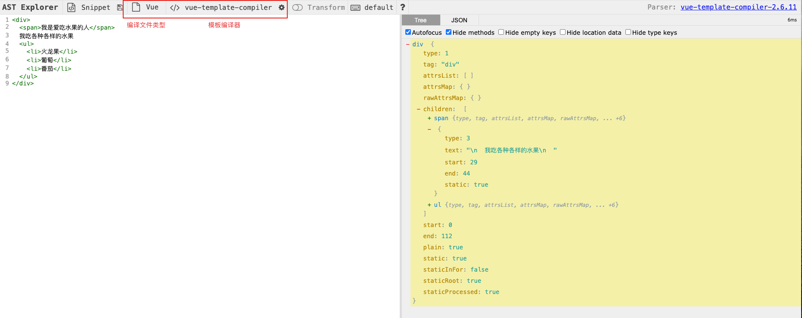

🔥从零手写vue2 - template模版解析

本专栏是打算从零手写一个 vue2，并学习 vue2 中的一些核心理念。

[专栏文章一 - 🔥从零手写vue2 - 虚拟节点以及createElement函数](https://juejin.cn/post/7421103437607370806)

# 一、template选项

在虚拟节点那节中，我们了解到 vue框架 是基于 vnode 来渲染页面的。

在 vue 中，可以将 template 作为选项传入 vue 构造函数。

```js
new Vue({
  template:`我是 template 内容，是一个模板字符串`
})
```
template内容如下。
```js
"<div>
  <span>我是爱吃水果的人</span>
  我吃各种各样的水果
  <ul>
    <li>火龙果</li>
    <li>葡萄</li>
    <li>番茄</li>
  </ul>
</div>"
```
vue 就是将这样一个模板字符串变成 vnode 的。

拿到 vnode以后，就可以将 vnode转化成真实 DOM 元素然后渲染到页面上。

渲染功能我们后面的章节会带着大家一步一步去实现。

我们在本章中会一步一步带大家实现这样一个模板解析器。

# 二、模板编译转化步骤

在 vue-template-compiler 中，模板解析大致分为 2 步：

1. 将模板转化成 AST
2. 将 AST转化成 render 函数 

所以上面的模板最终会变成下面的render函数：

```js
render:new Function(`with(this){return _c('div',[
  _c('span',[
    _v("我是爱吃水果的人")
  ]),
  _v("            我吃各种各样的水果            "),
  _c('ul',[
    _c('li',[_v("火龙果")]),
    _v(" "),
    _c('li',[_v("葡萄")]),
    _v(" "),
    _c('li',[_v("番茄")])
  ])
])}`)
``` 

> _c就是我们上一篇文章提到的 createElement 。
>
> createElement是方便我们生成 vnode的。
>
> _v就是我们上一篇文章提到的创建文本的函数：```createTextVNode```。

```new Function()``` 可以根据参数内容生成一个函数。

而```with(this)```语句意味着函数体内的所有变量都将从 this对象中查找，比如上面的```_v、_c```。

所以执行生成的 render 函数就可以获取模板对应的 vnode。

## 2.1 第一步：将 template模板 转化成 AST

因为模板就是一段字符串，是非结构化的数据，不利于进行分析。

所以第一步是将非结构化的模板字符串，换变成结构化的 JS对象，抽象语法树，即 AST。

这个网站[ast](https://astexplorer.net/)可以将模板转成成对应的 AST。

> 注意解析内容选择 ```Vue```，解析器选择 ```vue-template-compiler```。




## 2.2 第二步：将 AST 转化为 render 函数

在得到 模板 对应的 AST 对象以后。
 
先转换为一段函数体的字符串，然后再用 ```new Function(`with(this){return 函数题字符串}`)```生成对应的 render函数。

# 三、编译器模板源码编写

在 vue 源码中，是使用 compileToFunctions 传入 template 生成 render函数。

```js
const { render, staticRenderFns } = compileToFunctions(
    template,
    {
      outputSourceRange: __DEV__,
      shouldDecodeNewlines,
      shouldDecodeNewlinesForHref,
      delimiters: options.delimiters,
      comments: options.comments
    },
    this
)
```

而 compileToFunctions 函数是使用 createCompiler 函数进行生成的。

很容易写出以下代码。

```js
// platforms/web/compiler.js
import { createCompiler } from "@/my-vue2/compiler";

const { compileToFunctions } = createCompiler();

export {
    compileToFunctions
}

// compiler/index.js

export const createCompiler = () => {
    return {
        compileToFunctions:(template, options, vm)=>{
            // 1.生成AST
            const ast = parse(template.trim(), options);
            // 2.AST生成 render
            const render = generate(ast, options);
            return {
                render
            }
        }
    }
}
```
所以我们只需要实现 parse 和 generate 即可。

# 四、如何将 template模板 转化成 AST？ 

上面我们知道 vue 中是使用 parse 函数来实现

该函数的作用是将模板变成 AST树。

## 4.1 核心原理介绍 - 标签和栈

 

如上图，正常的一个模板字符串内容是一棵规范的DOM树。

每个标签（如：```<div></div>```）上都有属于自己的开始标签（```<```）、闭合标签（```>```）和结束标签（```</```）。

自闭合标签（如：``````）只有开始标签（```<```）和结束/闭合标签（```/>```）。

根据这个规律，我们发现每一个开始标签一定有对应的闭合标签。

这种一一对应的关系很容易让人联想到使用栈来实现这个功能。

> ```栈顶中的字符表示正在解析中的字符```。
>
> ```解析中遇到的子元素信息、属性信息都可以设置在栈顶的元素中```。
>
> ```当一个字符解析完以后就将栈顶元素移除```。
>
> ```当栈变成空时，代表已经解析完毕```。
>
> 栈是一个有序的数组结构，很容易理解，```栈顶的元素是栈顶下面元素的子元素```。

### 4.1.1 初始化解析


> 红色指针代表字符串解析的位置索引。
>
> 红色曲线指针指向当前栈顶元素。
>
> 右边方块代表解析过程中形成的堆栈。

初始解析位置为 -1，代表没有开始解析，此时堆栈为空。

这个时候构建一个root对象，用作最终解析的 AST对象。

```js
let ast = {}
```

### 4.1.2 解析第一个标签 （div）


* 解析步骤：

1. 指针索引移到第一位。解析发现 ```<```(且不是```</```)，标识碰到了元素开始标签。

2. 开始解析```<```标签以及对应的```>```元素结束标签。

3. 当解析器解析完一个标签后，将这个标签推入堆栈中。

> 此时栈中只有一个元素 div，所以栈顶是 div元素。

4. 此时解析指针向后移动，移动到```<span>```标签的开始标签上。

* AST对象变化：

因为这个div是第一个元素，也就是根对象，所以直接将信息放在 ast对象上。

此时可以更新这个 AST对象。

```js
let ast = {
  tag: 'div',
  type: 1
}
```

> vue ast 中 type为 1 表示一个元素类型

### 4.1.3 解析第二个标签（span）


* 解析步骤：

1. 指针索引移到```<span>```第一位。解析发现 ```<```，且不是```</```，标识碰到了元素开始标签。

2. 开始解析```<```标签以及对应的```>```元素结束标签。
3. 当解析器解析完一个标签后，将这个标签推入堆栈中。

> 此时栈中有一个元素 div和一个元素 span，栈顶是 span 元素。

4. 此时解析指针向后移动，移动到```<span>```标签内部的文字上。

* AST对象变化：

很明显span元素是 div元素的子元素。

我们将 children 属性当做子元素。

```js
let ast = {
  type:1,
  tag:'div',
  children:[
    {
      type:1,
      tag:'span'
    }
  ]
}
```

### 4.1.4 解析标签内部文字


* 解析步骤：

1. 指针索引移到文字的第一位，然后一直向后移动，直到遇到```<```标签。
2. 截取指针移动的所有字符，当做栈顶处理中元素的子节点。

> 此时栈中有一个元素 div和一个元素 span，栈顶依然是 span 元素。

* AST对象变化：

我们将截取的文字当做文字节点传进 span的 children属性中。

```js
let ast = {
  type:1,
  tag:'div',
  children:[
    {
      type:1,
      tag:'span',
      children:[
        {
          type:3,
          text:'我是爱吃水果的人'
        }
      ]
    }
  ]
}
```

> vue ast 中 type为 3 表示一个文本类型，text为文本的值。

### 4.1.5 解析标签结束标签（```</span```）

