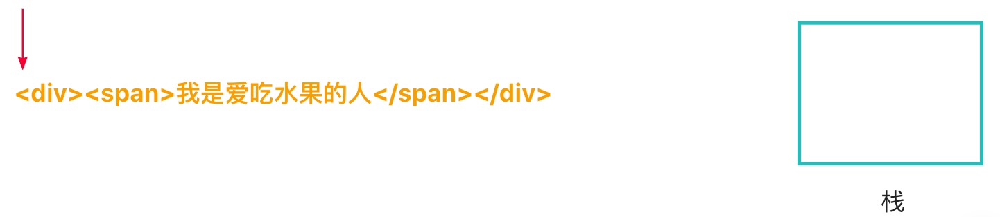
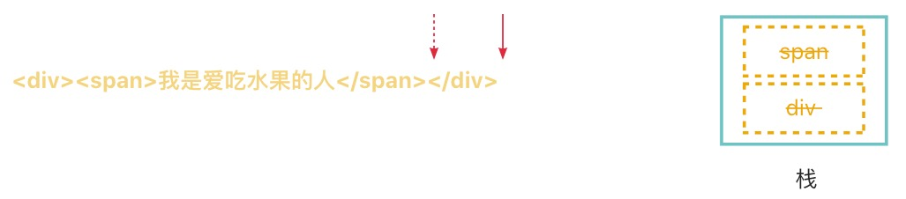

🔥从零手写vue2 - template模板解析

本专栏是打算从零手写一个 vue2，并学习 vue2 中的一些核心理念。

[专栏文章一 - 🔥从零手写vue2 - 虚拟节点以及createElement函数](https://juejin.cn/post/7421103437607370806)

# 一、template选项

在[专栏文章一 - 🔥从零手写vue2 - 虚拟节点以及createElement函数](https://juejin.cn/post/7421103437607370806)中，我们了解到 vue框架 是基于 vnode 来渲染页面的。

在 vue 中，可以将 template 作为选项传入 vue 构造函数。如下：

```js
new Vue({
  template:`我是爱吃水果的人`
})
``` 
template选项传入在 vue中被称作模板，代表用户需要在界面上展示一些内容。

在 vue框架 内部对这个模板选项进行处理，可以根据模板获取到对应的 vnode。

拿到 vnode以后，就可以将 vnode转化成真实 DOM 元素然后渲染到页面上。

渲染功能我们后面的章节会带着大家一步一步去实现。

我们在本章中会一步一步带大家实现这样一个模板解析器。

# 二、模板编译转化步骤

在 vue 中，模板解析大致分为 2 步：

1. 将模板转化成 AST
2. 将 AST转化成 render 函数 

上面的模板最终会变成下面的render函数。

```js
render:new Function(`with(this){return _c('div',[
  _c('span',[
    _v("我是爱吃水果的人")
  ])
])}`)
```   
> _c就是我们上一篇文章提到的 createElement 函数 。执行createElement函数可以方便我们生成 vnode。
> 
> _v就是我们上一篇文章提到的创建文本的函数：```createTextVNode```。

```new Function()``` 可以根据参数内容生成一个函数。

而```with(this)```语句意味着函数体内的所有变量都将从 this对象中查找，比如上面的```_v、_c```。

所以执行生成的 render 函数就可以获取模板对应的 vnode。

## 2.1 第一步：将 template模板 转化成 AST

因为模板就是一段字符串，是非结构化的数据，不利于进行分析。

所以第一步是将非结构化的模板字符串，换变成结构化的 JS对象抽象语法树，即 AST。

这个网站[ast](https://astexplorer.net/)可以将模板转成成对应的 AST。

> 注意解析内容选择 ```Vue```，解析器选择 ```vue-template-compiler```。


## 2.2 第二步：将 AST 转化为 render 函数

在得到 模板 对应的 AST 对象以后。
 
先转换为一段可以创建元素的字符串，然后再用 ```new Function(`with(this){return 函数体字符串}`)```生成对应的 render函数。

# 三、编译器结构编写

在 vue 源码中，是使用 compileToFunctions 传入 template 生成 render函数的。

```js
const { render, staticRenderFns } = compileToFunctions(
    template,
    {
      outputSourceRange: __DEV__,
      shouldDecodeNewlines,
      shouldDecodeNewlinesForHref,
      delimiters: options.delimiters,
      comments: options.comments
    },
    this
)
```

而 compileToFunctions 函数是使用 createCompiler 函数进行生成的。

很容易写出以下代码。

```js
// platforms/web/compiler.js
import { createCompiler } from "@/my-vue2/compiler";

const { compileToFunctions } = createCompiler();

export {
    compileToFunctions
}

// compiler/index.js
export const createCompiler = () => {
    return {
        compileToFunctions:(template, options, vm)=>{
            // 1.生成AST
            const ast = parse(template.trim(), options);
            // 2.AST生成 render
            const { render } = generate(ast, options);
            return {
                render
            }
        }
    }
}
```
所以我们只需要实现 parse 和 generate 即可。

# 四、如何将 template模板 转化成 AST？  

parse 函数的作用是将模板变成 AST树。

## 4.1 核心原理介绍 - 标签和栈


如上图，正常的一个template模板字符串内容是一棵规范的DOM树。

每个标签（如：`<div></div>`）上都有属于自己的`开始左开标签（<）`、`开始闭合标签（>）`、`结束左开标签（</）`和`结束闭合标签（>）`。

自闭合标签（如：``）只有`开始左开标签（<）`和`结束闭合标签（/>）`。

根据这个规律，我们发现每一个开始标签一定有对应的闭合标签。

这种一一对应的关系很容易让人联想到使用栈来实现这个功能。

原理解析： 

 0. 初始化时构建一个空的 ast对象和一个堆栈数组存储解析中的标签。

 1. 每当我们遇到`<`时，会检查是开始左开标签`（如<div> 的 <）`还是闭合左开标签的`如（</div>）的<`： 

 2. 如果是开始左开标签，说明这是一个开始标签。然后开始继续解析，直到遇到开始闭合标签。此时可以解析获得到该标签的属性名、属性信息等。将这些信息存储在对象中，然后将其推进堆栈中。因为此时还没遇到结束闭合标签，所以表示该标签还没有解析完毕。我们需要继续解析，当遇到一个开始标签时，重复执行步骤二；当遇到一个闭合标签是，执行步骤三。

 3. 如果是结束左开标签，说明这是一个结束标签。然后继续解析，直到遇到结束闭合标签。此时可以解析获得该标签的标签名。```然后看是否和栈顶元素保持一致。如果一致，则将栈顶元素存放在他父元素的 children属性下，然后直接移除栈顶元素。```此时标签的解析权移交给了他的上一个元素，即他的父元素。然后继续解析，当遇到一个开始标签时，执行步骤二；当遇到一个闭合标签是，重复执行步骤三。

 4. 当字符串解析完毕，且堆栈为空，则表示已经解析完毕，此时 ast 就是我们解析出来的 AST对象。

 
根据上面的步骤解析，不难看出下面几点：

> 1. 栈顶中的元素是正在解析的元素
>
> 2. 解析中遇到的子元素信息、属性信息都可以设置在栈顶的元素中。
>
> 3. 当一个字符解析完以后就将栈顶元素移除。
>
> 4. 当栈变成空时，代表已经解析完毕。
>
> 5. 栈是一个有序的数组结构，很容易理解```栈顶的元素是栈顶下方元素的子元素```。

## 4.2 试着解析一个简单的字符串

### 4.2.1 初始化解析

 

> 红色指针代表字符串解析的位置索引。
>
> 红色曲线指针指向当前栈顶元素（初始时栈中无元素，所以无此线）。
>
> 右边方块代表解析过程中形成的堆栈。

从模板第一位开始解析，解析位置为 0。 代表没有开始解析，此时堆栈为空。

这个时候构建一个root对象，用作最终解析的 AST对象。 

再构建一个stack堆栈来存储解析中的元素（栈顶元素）。 

```js
let  rootAst = {};

let stack = [];
```

### 4.2.2 解析第一个标签 （div）


* 解析步骤：

1. 初始化时指针索引移到第一位。解析发现 ```<```(且不是```</```)，意味碰到了元素开始标签。

2. 指针继续向后移动解析```<```元素开始标签以及对应的```>```元素结束标签。

3. 直至解析到```>```，说明该标签的开始标签已经解析完成。当解析器解析完一个标签的开始标签后，将这个标签对应的对象信息推入堆栈中。此时栈中只有一个元素 div，所以栈顶是 div元素。此时还没遇到闭合标签，所以当前标签就是正在解析的标签。 

4. 此时解析指针向后移动，移动到```<span>```标签的```<```开始标签上。

* AST对象 & 堆栈数组 变化：

因为这个div是第一个元素，也就是根对象，所以直接将信息放在 ast对象上。

此时可以更新这个 AST对象。

```js
let ast = {
  tag: 'div',
  type: 1
}

let stack = [{tag:'div',type:1}]
```

> vue ast 中 type为 1 表示一个元素类型

### 4.2.3 解析第二个标签（span）


* 解析步骤：

1. 此时指针索引移到```<span>```第一位。解析发现 ```<```，且不是```</```，标识碰到了元素开始标签。

2. 指针继续向后移动解析```<```元素开始标签以及对应的```>```元素结束标签。

3.  直至解析到```>```，说明该标签的开始标签已经解析完成。当解析器解析完一个标签的开始标签后，将这个标签推入堆栈中。此时栈中有一个元素 div和一个元素 span，栈顶是 span 元素。所以 span元素就是当前正在解析的元素。 

4. 此时解析指针向后移动，移动到```<span>```标签内部的文字上。

* AST对象变化：

很明显span元素是 div元素的子元素。

但是此时 span元素并没有解析完成，所以ast对象没有变化。

不过会将构建的信息推入堆栈。

```js
let ast = {
  type:1,
  tag:'div'
}

let stack=[
  {type:1,tag:'div'},
  {type:1,tag:'span'},
]
```

### 4.2.4 解析标签内部文字


* 解析步骤：

1. 此时指针索引在span内文字的第一个位置，发现不是`<`标签，意味着可能是文字内容，文字内容在 AST中也被解析为一个节点，将来也会被放置在子元素中。

2. 指针继续向后移动解析，直至遇到了`<`元素。这表示文字解析完毕。

3. 截取指针移动过的所有字符，当做栈顶处理中元素的子节点。此时栈中有一个元素 div和一个元素 span，栈顶依然是 span 元素。 所以 span元素依然还是当前正在解析的元素。 

* AST对象变化： 

如果是文字内容，会直接将其推入其父元素的 children属性中。

而此时他的父元素是栈顶元素 span。

所以堆栈会这么变化。

```js
let ast = {
  type:1,
  tag:'div',
}

let stack = [
  { type:1,tag:'div'},
  { type:1,tag:'span',children:[
    {
      type:3,
      text:'我是爱吃水果的人'
    }
  ]},
]
```
> vue ast 中 type为 3 表示一个文本类型，用 text属性来存储字符内容。

### 4.2.5 解析标签结束标签（```</span```）


* 解析步骤：

1. 此时指针索引在```<```位上，然后发现该位置上的第二个标签是```/```，这意味着这个时候解析到了元素的闭合标签。

2. 指针继续移动，直至遇到```>```获取到元素对应的 ```tag为 span```。然后查看是否和栈顶元素一样，发现一样。说明此时 span标签解析完毕，说明 span元素就是 div元素的子元素，然后将span元素变成 div元素的子元素。最后移除栈顶span元素。此时栈中只有一个元素 div，则栈顶是 div 元素。所以现在div元素变成了现在正在解析的元素。

3. 指针继续向后移动。

* AST对象变化：

span元素处理结束，此时

```js
let ast = {
  type:1,
  tag:'div',
  children:[
    {
      type:1,
      tag:'span',
      children:[
        {
          type:3,
          text:'我是爱吃水果的人'
        }
      ]
    }
  ]
}

let stack = [
  { type:1, tag:'div' }
]
```

### 4.2.6 解析标签结束标签（```</div```）
 


* 解析步骤：

1. 此时指针索引在```<```位上，然后发现该位置上的第二个标签是```/```，这意味着这个时候解析到了元素的闭合标签。

2. 指针继续移动，直至遇到```>```获取到元素对应的 ```tag为 div```。然后查看是否和栈顶元素一样，发现一样。然后移除栈顶div元素。

> 此时栈中元素已经清空，代表已经解析完成。 

3. 此时字符串已经解析完成。

* AST对象变化：

此时模板已经全部解析完毕。

```js
let ast = {
  type:1,
  tag:'div',
  children:[
    {
      type:1,
      tag:'span',
      children:[
        {
          type:3,
          text:'我是爱吃水果的人'
        }
      ]
    }
  ]
}

let stack = [];
```

## 4.3 源码编写-parse函数大致结构 

parse函数就是用来将模板转化成 AST的核心函数。

第一个参数就是模板字符串。

第二个参数是一个选项。

我们按照vue源码的目录结构。

定义 parse函数，然后再 parse函数中返回 AST。

其中html-parser文件中的parseHTML函数是专门用来解析 html模板的。

```js
// compiler/parse/index.js
import { parseHTML } from "./html-parser";

export function parse(template,options){

    let rootAst = {};
    
    parseHTML(template); 

    return rootAst;
}
// compiler/parse/html-parser.js
// 解析模板
export function parseHTML(html){ 
}
```

## 4.4 源码编写-parseHTML && parse

parseHTML 函数中包含了解析标签的细节。

### 4.4.1 遍历模板

while 循环在这里的作用是确保每次迭代都会处理一部分 HTML 字符串，直到没有剩余的字符串需要处理为止。

这样的循环结构适合用于处理不确定长度的数据流，直到所有数据都被消费掉为止。

```js
// 解析模板
export function parseHTML(html){
  // while 循环会持续进行，直到 html 变成了空字符串。
  while(html){      
  }
}
```

### 4.4.2 依据 ```<``` 进行判断

```js
while(html){
  const textEnd = html.indexOf("<")
}
```
解析字符串的过程中碰到`<` 符号就会在内部使用`正则表达式对剩余字符串进行匹配`进而判断它是元素开始标签还是元素结束标签。 

```js
if(/元素开始正则/.test(html)){
  console.log("元素开始标签")
}else if(/元素结束正则/.test(html)){
  console.log("元素结束标签")
}
```


> `textEnd 变量存储了 < 符号首次出现的位置。`

那么为什么是```<```符号呢？

> 因为在 HTML 中，```<``` 符号通常标志着一个新的标签的开始。
>
> 因此，在解析过程中查找 ```<``` 符号可以帮助我们确定何时开始处理一个新的 HTML 标签。

当解析器遇到 ```<``` 符号时，它会根据后续的字符来判断接下来的内容是标签、注释还是其他结构：

1. 如果紧随 < 后面的是 /，则表示这是一个结束标签；
2. 如果紧随 < 后面的是 !，则可能是 HTML5 的文档类型声明（DOCTYPE）；
3. 如果是其他字母，则可能是一个开始标签。


### 4.4.3 定义匹配的相关正则

vue源码需要精确的匹配符号，所以使用正则：

1. unicodeRegExp

```js
// core/util/lang
export const unicodeRegExp =
  /a-zA-Z\u00B7\u00C0-\u00D6\u00D8-\u00F6\u00F8-\u037D\u037F-\u1FFF\u200C-\u200D\u203F-\u2040\u2070-\u218F\u2C00-\u2FEF\u3001-\uD7FF\uF900-\uFDCF\uFDF0-\uFFFD/
```

用来匹配 Unicode 字符集中的一系列字符，这些字符通常被认为是“字母”或“标识符”的一部分。

这里就是匹配标签名。

2. ncname

```js
// source代表正则
const ncname = `[a-zA-Z_][\\-\\.0-9_a-zA-Z${unicodeRegExp.source}]*`
```
用来匹配非限定名称，也就是不包含冒号的 XML 名称或属性名。其中首字母为必须为```a-z、A-Z、_```的其中一项。

3. qnameCapture

```js
const qnameCapture = `((?:${ncname}\\:)?${ncname})`
```
用来匹配所谓的 “限定名称”。（Qualified Name，简称 QName）。

该表达式可以匹配：

* 不带前缀的QName：例如element、attribute。
* 带前缀的 QName：例如ns:element、prefiex:attr。

4. startTagOpen

```js
const startTagOpen = new RegExp(`^<${qnameCapture}`)
```
用于匹配HTML开始标签的开头部分。

这个正则可以匹配```<div>```、```<foo:bar>```等标签的开头部分。

5. startTagClose 

```js
const startTagClose = /^\s*(\/?)>/
```
用来匹配HTML标签的结束部分，即从标签的结束符号 ```>``` 开始之前的空白字符（如果有）到 `>` 本身。

这个正则可以匹配`>`、`/>`、`  div>`这四种情况。

6. endTag

```js
const endTag = new RegExp(`^<\\/${qnameCapture}[^>]*>`)
```

用来匹配 HTML 或 XML 中的结束标签（也称为闭合标签）。这个正则表达式的设计目的是为了识别一个标签的结束，并且捕获该标签的名称。

7. attribute

用来匹配 HTML 或 XML 中的属性（attributes）。

```js
const attribute =
  /^\s*([^\s"'<>\/=]+)(?:\s*(=)\s*(?:"([^"]*)"+|'([^']*)'+|([^\s"'=<>`]+)))?/
```
8. dynamicArgAttribute

用来匹配 Vue.js 中动态参数（动态参数化）的属性。

这种属性通常出现在 Vue 的指令、事件监听器、绑定等语法中，允许使用方括号 [] 来传递动态参数。

```js
const dynamicArgAttribute =
  /^\s*((?:v-[\w-]+:|@|:|#)\[[^=]+?\][^\s"'<>\/=]*)(?:\s*(=)\s*(?:"([^"]*)"+|'([^']*)'+|([^\s"'=<>`]+)))?/
```

### 4.4.4 advance截取字符串

因为我们使用的是 while循环，且循环条件为 html。

所以我们每次解析完以后需要将html解析过的部分去除。

如果不处理 html则会无限循环下去。

```js
function advance(n){
  html = html.substring(n)
}
```

每当解析完一些字符后，可以调用 advance函数去掉解析过的部分，防止重复解析。

### 4.4.5 parseHTML 解析的三个回调
 
parseHTML函数只负责解析 HTML。

对于 AST对象、stack堆栈数组是不作任何处理的。 

AST对象和 stack堆栈都是在 parse函数内部定义的。

那么 parseHTML函数 是如何跟 parse函数 进行通信（传递 AST相关信息）的呢？

当 parseHTML函数 解析`开始标签、结束标签、文本`之后会调用回调。

```js
// 解析模板 在回调中获取解析的信息 然后做相应处理
parseHTML(template,{
  // 开始标签
  start:(解析元素对象)=>{做对应处理},
  // 结束标签
  end:(解析元素对象)=>{做对应处理},
  // 文字
  char:(解析元素对象)=>{做对应处理},
}); 
// 解析完以后 回调传给parse函数 做解析
export function parseHTML(html,options){ 
  if(解析完开始元素){
    options.start(解析元素对象)
  }
  if(解析完结束元素){
    options.end(解析元素对象)
  }
  if(解析完文本){
    options.char(解析文本对象)
  }
}
``` 

### 4.4.6 parseHTML 处理开始标签 

```js
// 说明匹配到 <  可能是开始标签（<）或者闭合标签（</）
  if(textEnd === 0){
    // 解析开始标签
    const startTagMatch = parseStartTag();
    // 解析完成的对象
    if(startTagMatch){ 
      options.start(startTagMatch);
      continue
    }
  }

  function parseStartTag(){
    // 如果html为<div> 则 start[0]为<div start[1]为 div
    const start = html.match(startTagOpen);
    // 将匹配的标签名存在 match中
    const match = {
        tagName:start[1],
        attrs: [],
    }
    // 将解析过后的 html删除
    advance(start[0].length);
    // 匹配的结束标签
    let end;
    // 匹配的属性
    let attr;
    // 匹配属性
    // 如果没有匹配到结束标签 && 匹配到属性 继续遍历
    // 反之，如果匹配到结束标签 || 不能匹配到属性 则结束遍历
    while(
        !(end = html.match(startTagClose)) && 
        (attr = html.match(dynamicArgAttribute) || html.match(attribute))
    ){
      advance(attr[0].length);
      match.attrs.push(attr);
    }
    if(end){
      advance(end[0].length)
      return match;
    }
  }

```

使用 parseStartTag函数 来解析开始标签以及对应的属性。

最终生成一个 match对象。

这个 match对象中就包含了开始标签的相关信息。

然后调用 options.start 将该对象传入。

再在parse/index.js的 start回调中设置 ast。

### 4.4.7 parse 处理开始标签

上文我们说到在 parseHTML模块处理完开始标签后就会调用 options.start 进行回调传入解析完的属性。 
 
#### 4.4.7.1 createASTElement

为了统一ast的格式，使用createASTElement函数来创建元素 AST。

元素 AST的 type为 1。

```js
export function createASTElement(
    tag,
    attrs,
    parent
){
    return {
        type:1,
        tag,
        attrList:attrs,
        parent,
        children:[]
    }
}
```

#### 4.3.7.2 stack元素数组

每次解析完开始标签后，都会使用上面提到的 createASTElement 来创建一个新的元素。

然后再将此元素推入栈中。

stack 用于记录已经解析过的元素节点的顺序，从而在遇到结束标签时能够正确地回溯到对应的父节点。

它通过压入和弹出元素来维持当前解析的元素层次关系。
 
stack 的使用使得模板解析更加健壮，能够正确处理嵌套的元素结构。

#### 4.4.7.3 具体处理开始元素

```js
parseHTML(template,{
        start:(startMatch)=>{
            // 当开始元素解析完毕 需要创建一个新的元素 ast节点
            const element = createASTElement(startMatch.tagName, startMatch.attrs, currentParent)
            // 如果没有根节点 设置根节点
            if(!rootAst){
                rootAst = element
            }
            // 将当前元素推入栈中
            stack.push(element);
        },
        end:()=>{},
        chars:()=>{},
}); 
```
首先，创建开始元素标签对应的元素节点。

其次，如果 rootAST没有值，代表模板刚开始解析。这是遇到的第一个开始元素，可以直接将 rootAST赋值给元素。

最后，将这个元素推入到堆栈中。

### 4.4.8 parseHTML 具体处理文本

当 textEnd大于 0时，可以判断现在解析的是文字了。

在遇到下个`<`时，中间走过的字符串截取出来，调用 options.chars进行回调。

```js
export function parseHTML(){
        // text表示文本 rest表示截取文本后的属于字符串 
        let text
        // 第一位不是标签 表明非元素 即为文本
        if (textEnd >= 0) {
            text = html.substring(0, textEnd)
        }
        if (text) {
            advance(text.length)
        }
        if (options.chars && text) {
            options.chars(text)
        }
}
```

### 4.4.9 parse 处理文本

首先获取当前处理中的元素，然后将生成一个 文字 ast对象放入 children属性中。

```js
parseHTML(template,{
        start:(startMatch)=>{ 
          ///xxx
        },
        end:()=>{},
        chars:(text)=>{
            // 获取栈顶元素 即当前处理中的元素 为文字节点的父元素
            let currentParent = stack[stack.length-1];
            currentParent.children = currentParent.children || [];
            currentParent.children.push({
                type:3,
                text
            })
        },
});
```
### 4.4.10 parseHTML 处理结束标签 

继续解析剩余的字符串，当解析完之后，调用 options.end传入parse函数进行后续处理。

```js
// 解析结束标签
// 假设这里html是</span></div>
// endTagMatch 为["</span>","span"]
const endTagMatch = html.match(endTag)
if (endTagMatch) {
  advance(endTagMatch[0].length)
  options.end(endTagMatch[1]);
  continue
} 
```
### 4.4.11 parse 处理结束标签 

理论上栈顶元素应该与当前关闭元素相同，如标签错乱等其他情况暂不考虑。

首先弹出栈顶元素，即为关闭的元素。

判断如果此时栈为空，即表示元素处理完毕了，则需要构建 AST了。

所以赋值 AST === currentElement。

如果此时栈不为空，即表示元素还没有处理完毕，所以需要将当前要关闭的元素放到他父元素上，即现在的栈顶元素。

```js
parseHTML(template,{
        start:(startMatch)=>{
          // xxx
        },
        end:(tagName)=>{
            // 如果栈顶元素和当前元素相同
            if(stack[stack.length-1].tag === tagName){
                // 弹出栈顶元素
                const currentElement = stack.pop();
                if(stack.length === 0){
                    rootAst = currentElement;
                }else{
                    // 当前栈顶元素是弹出元素的父元素
                    let currentParent = stack[stack.length-1];
                    currentParent.children = currentParent.children || [];
                    currentParent.children.push(currentElement);
                } 
            }
        },
        chars:(text)=>{
          // xxx
        },
}); 
```

# 五、如何将 AST 转化为 render函数

在 vue中是通过 generate函数来生成 render函数的。

```js
// 传入 AST
const render = generate(ast)
```

在上节中，我们实现了利用 parse函数生成 AST。

现在有了机构化的 AST数据，就可以很容易的进行分析和组装。

## 5.1 了解 generate函数的大体结构

这个函数可以用来从AST生成渲染函数。

```js
export function generate(
    ast
){
    const code = ast ? genElement(ast) : '_c("div")'
    return {
        render:new Function(`with(this){return ${code}}`)
    }
}
```
1. `条件判断`：函数首先检查传入的参数 ast 是否存在（即是否为真值）。如果 ast 存在，则使用 genElement 函数来生成渲染代码；如果 ast 不存在或为假值（例如 null, undefined, 或者 false），则默认返回一个创建 div 元素的字符串 _c("div")。
2. `创建渲染函数`：使用 new Function 构造函数创建一个新的函数。这个新函数的函数体是通过字符串模板构造的，它使用了 with(this) 语法来确保函数内部的 this 指向正确的作用域，并且执行 return 语句来返回 code 所表示的内容。

## 5.2 genElement函数

1. 初始化返回字符串：

```js
let code;
```
这行代码声明了一个变量 code，它将会保存最终要返回的字符串形式的代码。

2. 定义标签名：

```js
let tag = `'${el.tag}'`;
```
这行代码将元素 el 的 tag 属性值包裹在单引号中，并赋值给变量 tag。例如，如果 el.tag 是 "span"，那么 tag 就会被设置为字符串 'span'。

3. 生成子元素代码：

```js
let children = genChildren(el);
```

这里调用了另一个函数 genChildren，传入当前元素 el。假设 genChildren 函数负责生成子元素的代码，并将其结果赋值给 children 变量。

4. 构建最终的 _c 调用：

```js
code = `_c(${tag}${children ? `,${children}` : ''})`;
```

这行代码构建了最终的字符串 code，其格式类似于 _c('tagName', children)。如果 children 存在（即 children 不为空或者 true），那么会在 tag 后面加上逗号和 children，否则只传递 tag。

5. 返回生成的代码：

```js
return code;
```

最后返回构造好的字符串 code。

总结来说，这个 genElement 函数的作用是从一个元素对象 el 中提取信息，并根据这些信息构造一个字符串，该字符串描述了如何使用 _c 函数创建一个 DOM 元素。

## 5.3 genChildren函数

```js
function genChildren(el){
    const children = el.children;
    if(children.length){
        return `[${children.map(child=>genNode(child)).join(",")}]`
    }
}
```
1. 获取子元素列表：

```js
const children = el.children;
```
这行代码获取了元素 el 的 children 属性，children 应该是一个数组，包含了该元素的所有子元素。

2. 检查子元素列表长度：

```js
if(children.length){
    return `[${children.map(child => genNode(child)).join(",")}]`;
}
```

这里先检查 children 数组是否有元素。如果有元素，也就是 children.length 大于 0，那么就进入条件块。

3. 处理子元素：

* 使用 map 方法遍历 children 数组中的每一个子元素 child。
* 对每个子元素调用 genNode(child) 函数，这个函数应该负责生成对应子元素的代码字符串。
* 使用 join(",") 方法将所有子元素的代码字符串连接起来，中间用逗号 , 分隔。
* 最终的结果被包裹在一个方括号 [ 和 ] 中，形成一个 JavaScript 数组表达式。

4. 返回结果：
 
如果 children 数组有元素，则返回上述构造好的数组表达式。如果没有元素（即 children.length 为 0），则函数不会返回任何值，即返回 undefined。

> 总结来说，genChildren 函数的作用是从给定的元素 el 的 children 属性中提取所有的子元素，并对每个子元素调用 genNode 函数来生成对应的代码字符串，然后把这些字符串以数组的形式返回。如果该元素没有子元素，则返回 undefined。

## 5.4 genText函数

```js
export function genText(text) {
  return `_v("${text.text}")`
}
```

> genText 函数的主要作用是从一个包含文本信息的对象中生成用于创建文本节点的代码字符串。
>
> 这里的 _v 函数是一个虚拟 DOM 创建函数，专门用于创建文本节点。

## 5.5 genNode函数

```js
function genNode(node) {
    if (node.type === 1) {
        return genElement(node)
    }else{
        return genText(node)
    }
}
```

> genNode 函数的作用是根据节点的类型来决定生成哪种类型的代码字符串。如果节点是一个元素节点，则调用 genElement 来生成元素节点的代码；如果是文本节点，则调用 genText 来生成文本节点的代码。这样可以根据不同的节点类型动态生成相应的虚拟 DOM 创建代码。

# 六、总结

在 vue模板编译中，总共分为两个部分：

1. 将模板字符串传入 parse函数，然后进行解析生成对应的 AST。
2. 将 AST 传入 generate函数，然后生成对应的创建元素的字符串。


> 本文中实现的模板编译没有考虑异常情况以及指令、data等。后续我们会慢慢补充。

想看下实现的对不对可以引入一下然后看界面是否正确即可。

```js 
import Vue from "vue/dist/vue.esm.browser"; 

const { render } = compileToFunctions(`<div><span>我是爱吃水果的人</span></div>`)

new Vue({
    render
}).$mount("#app")
```

[git源码地址](https://github.com/parrot-designa/learn-vue2-template)。