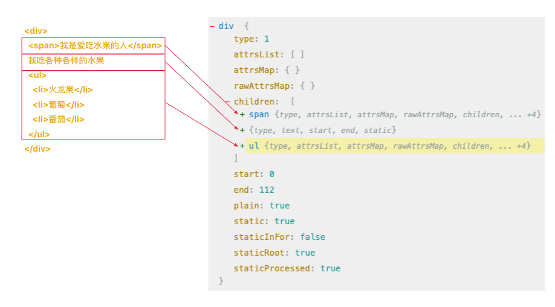

🔥从零手写vue2 - template模版解析

本专栏是打算从零手写一个 vue2，并学习 vue2 中的一些核心理念。

[专栏文章一 - 🔥从零手写vue2 - 虚拟节点以及createElement函数](https://juejin.cn/post/7421103437607370806)

# 一、template选项

在虚拟节点那节中，我们了解到 vue框架 是基于 vnode 来渲染页面的。

在 vue 中，可以将 template 作为选项传入 vue 构造函数。

```js
new Vue({
  template:`我是 template 内容，是一个模板字符串`
})
```
template内容如下。
```js
"<div>
  <span>我是爱吃水果的人</span>
  我吃各种各样的水果
  <ul>
    <li>火龙果</li>
    <li>葡萄</li>
    <li>番茄</li>
  </ul>
</div>"
```
vue 就是将这样一个模板字符串变成 vnode 的。

拿到 vnode以后，就可以将 vnode转化成真实 DOM 元素然后渲染到页面上。

渲染功能我们后面的章节会带着大家一步一步去实现。

我们在本章中会一步一步带大家实现这样一个模板解析器。

# 二、模板编译转化步骤

在 vue-template-compiler 中，模板解析大致分为 2 步：

1. 将模板转化成 AST
2. 将 AST转化成 render 函数 

所以上面的模板最终会变成下面的render函数：

```js
render:new Function(`with(this){return _c('div',[
  _c('span',[
    _v("我是爱吃水果的人")
  ]),
  _v("            我吃各种各样的水果            "),
  _c('ul',[
    _c('li',[_v("火龙果")]),
    _v(" "),
    _c('li',[_v("葡萄")]),
    _v(" "),
    _c('li',[_v("番茄")])
  ])
])}`)
``` 

> _c就是我们上一篇文章提到的 createElement 。
>
> createElement是方便我们生成 vnode的。
>
> _v就是我们上一篇文章提到的创建文本的函数：```createTextVNode```。

```new Function()``` 可以根据参数内容生成一个函数。

而```with(this)```语句意味着函数体内的所有变量都将从 this对象中查找，比如上面的```_v、_c```。

所以执行生成的 render 函数就可以获取模板对应的 vnode。

## 2.1 第一步：将 template模板 转化成 AST

因为模板就是一段字符串，是非结构化的数据，不利于进行分析。

所以第一步是将非结构化的模板字符串，换变成结构化的 JS对象，抽象语法树，即 AST。

这个网站[ast](https://astexplorer.net/)可以将模板转成成对应的 AST。

> 注意解析内容选择 ```Vue```，解析器选择 ```vue-template-compiler```。




## 2.2 第二步：将 AST 转化为 render 函数

在得到 模板 对应的 AST 对象以后。
 
先转换为一段函数体的字符串，然后再用 ```new Function(`with(this){return 函数题字符串}`)```生成对应的 render函数。

# 三、编译器模板源码目录的复杂性

为了方便编译器后续进行拆分和扩展，编写了的很复杂，源码函数互相调用，让人难以理解。

## 3.1 compileToFunctions

从名字我们就可以看出来这个函数的意思就是“编译成函数“。

在 vue 源码中我们利用 compileToFunctions 方法 生成render函数。

```js
// 生成render函数
const { render } = compileToFunctions(template, this);
```
compileToFunctions函数在 platforms/web/compiler 中定义。 
```js
// 调用createCompiler生成compileToFunctions函数
// baseOptions包含了编译时需要的一些工具类和选项等
const { compileToFunctions } = createCompiler(baseOptions)
```
> baseOptions包含了编译时需要的一些工具类和选项等。

## 3.2 createCompiler

从名字我们就可以看出来这个函数的意思就是“创建编译函数“。

对应的代码在 compiler/index.js 文件中。

所以 createCompiler 函数的返回值就是一个对象，对象上有一个render属性，值是一个函数。

而 createCompiler 函数是由 createCompilerCreator 函数生成的。

```js
export const createCompiler = createCompilerCreator(function baseCompile(
    template,
    options
) {
    //xxx
})
```

## 3.3 createCompilerCreator

从名字我们就可以看出来这个函数的意思就是“创建编译函数的构造函数“。

可以得出createCompilerCreator的返回值即为 createCompiler函数。 

```js
export function createCompilerCreator(baseCompile){
    return function createCompiler(baseOptions){
      return {
        compileToFunctions: createCompileToFunctionFn(compile)
      }
    }
}
```

## 3.4 compile函数

最后，我们将目光落到了```createCompileToFunctionFn(compile)```中。

在这个 compiled函数中实际上调用了模板编译的核心方法，生成了


